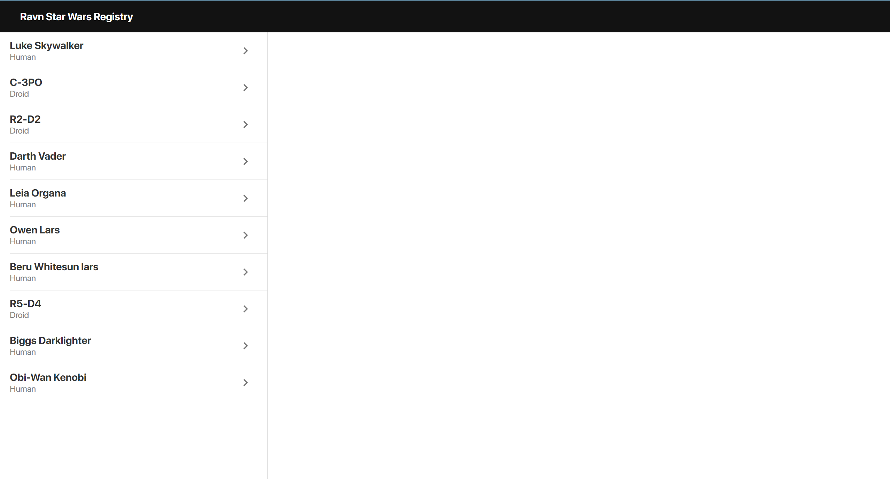

# Ravn Challenge

## Descripción

Ravn Challenge es un proyecto desarrollado en React y TypeScript. Este proyecto utiliza las librerías MUI (Material-UI) y react-loader-spinner.

El diseño de la aplicación se basa en el concepto de Atomic Design, lo que significa que los componentes están organizados en átomos, moléculas, organismos, plantillas y páginas, siguiendo las mejores prácticas de diseño de componentes.

## Despliegue
https://ravn-challenge-piero-pozo.netlify.app/

## Capturas de Pantalla

## Tecnologías Utilizadas

- React
- TypeScript
- Material-UI (MUI)
- react-loader-spinner

## Instalación

Para instalar y ejecutar este proyecto en tu entorno local, sigue estos pasos:

1. Clona este repositorio en tu máquina.
2. Ejecuta `yarn install`.
3. Para correr el proyecto, ejecuta `yarn start`.

### Autor
Piero Pozo
